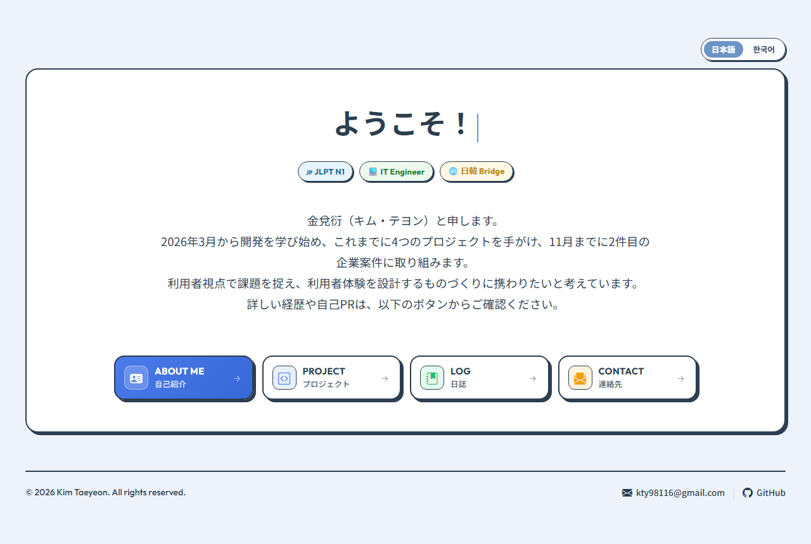

# 金兌衍（キム・テヨン） ポートフォリオサイト

自己紹介・プロジェクト・学習日誌・連絡先をまとめた、日本語／韓国語の2言語ポートフォリオサイトです。
フロントエンドはフレームワークを使わず HTML / CSS / JavaScript で作り、FastAPI のサーバーでゲストブックと日誌データを提供しています。



## ページ構成

| ページ | URL | 内容 |
|---|---|---|
| ホーム | `#/` | あいさつと各ページへの入口 |
| 自己紹介 | `#/about` | 自己PR・技術スタック・経験・学歴・趣味 |
| プロジェクト | `#/project/<id>` | 4件のプロジェクト（概要・企画・画面設計・デモ・開発ログ） |
| 日誌 | `#/log` | 2026年3月からの学習日誌（月別の記録と活動カレンダー） |
| 連絡先 | `#/contact` | メール・GitHub・ゲストブック |

- 各ページに URL があるため、リンクの共有・再読み込み・ブラウザの「戻る」がそのまま使えます。
- `?lang=ja` / `?lang=ko` で表示言語を指定したリンクを作れます（例: `/?lang=ja#/project/hospital`）。

## 主な機能

- **日本語・韓国語の切り替え** — 画面の文言を2言語で管理し、選んだ言語はブラウザに保存されます。
- **レスポンシブ対応** — PC とスマートフォン（幅 390px）の両方で表示を確認しています。
- **ゲストブック** — FastAPI の API で SQLite に保存。IP ごと・全体の投稿数を制限し、新しい投稿はメールで通知します（任意設定）。
- **学習日誌** — Notion の日誌を `sync_notion.py` で取り込み、月ごとの記録と活動カレンダーで表示します。
- **プロジェクトの UI モックアップ** — 健康診断予約プロジェクトのモックアップは、サーバーなしでブラウザ内のサンプルデータで動きます（施設名・地域・連絡先はすべてサンプル）。

## 技術スタック

| 区分 | 使用技術 |
|---|---|
| フロントエンド | HTML5, CSS3, JavaScript (Vanilla JS), LocalStorage |
| バックエンド | Python, FastAPI, Uvicorn, SQLite |
| 外部サービス | Notion API, Gmail SMTP（ゲストブック通知・任意） |
| 設計 | Figma（ワイヤーフレーム） |

## ディレクトリ構成

```
├── index.html              # 全ページ（SPA）
├── style.css
├── script.js               # 画面遷移・URL ルーティング・2言語対応・各ページの描画
├── main.py                 # FastAPI サーバー（静的ファイル配信・ゲストブック API・日誌 API）
├── sync_notion.py          # Notion の日誌を取り込むスクリプト
├── logdata.json            # 日誌ページのデータ
├── troubleshooting.json    # 架空読書会の開発ログ
├── hospital_devlog.json    # 健康診断予約の開発ログ
├── project_images/         # プロジェクトの画面キャプチャ
├── log_images/ memo_images/ hospital_images/
└── projects/hospital/mockup/   # 健康診断予約の UI モックアップ（匿名化済み）
```

## ローカルでの実行

```bash
pip install -r requirements.txt
cp .env.example .env        # 必要な項目だけ設定（空欄のままでも起動します）
python main.py              # http://127.0.0.1:8000
```

## セキュリティ上の配慮

- `.env`・`.git` などの隠しファイルと、公開対象外のフォルダは配信しないようにしています。
- ゲストブックの入力はサーバーで長さを検証し、表示時は HTML をエスケープしています。
- 管理用 API（ゲストブックの修正・削除、日誌の同期）はトークンがない限り使えません。
- 基本的なセキュリティヘッダー（`X-Content-Type-Options`・`X-Frame-Options` など）を付けています。

---

## 한국어 요약

자기소개·프로젝트·학습 일지·연락처를 담은 일본어/한국어 2개 국어 포트폴리오 사이트입니다.
프런트엔드는 프레임워크 없이 HTML/CSS/JavaScript 로 만들었고, FastAPI 서버가 방명록(SQLite)과 노션 일지 데이터를 제공합니다.
화면마다 주소(`#/about`, `#/project/hospital` 등)가 있어 링크 공유·새로고침·뒤로가기가 동작하며, `?lang=ko` 로 언어를 지정할 수 있습니다.
실행 방법과 구성은 위 일본어 설명과 같습니다.
